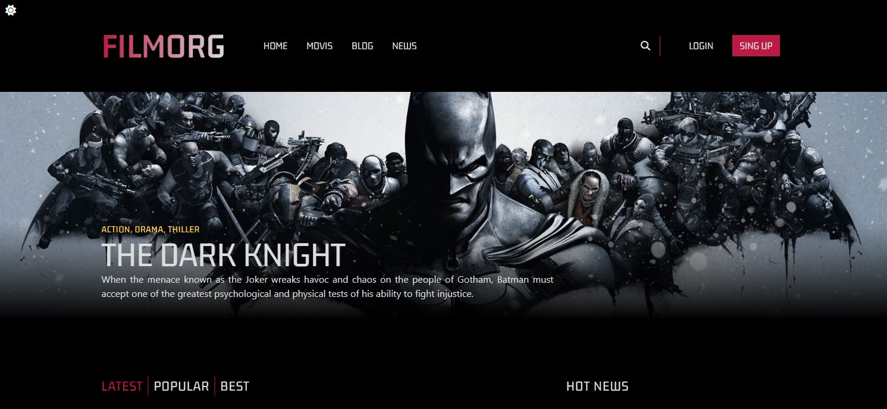
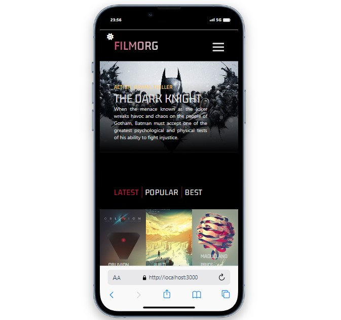

# FİLM APP

<br />
<div align="center" id="readme-top">
  <a href="#">
    
  </a>

  <h3 align="center">Film App</h3>
  <p align="center">
    <a href="https://react-tailwind-2-cyan.vercel.app/"><strong> 👩‍⚕️ LIVE 👨‍⚕️ »</strong></a>
    <br />
  </p>
</div>


## Description


An example movie site created using the React router structure and tailwind css, also in dark mode and light mode.

## Features

Data is retrieved from the API using the GET operation.
Data is added to the API by performing a POST operation.
Data can be deleted from the API by executing a DELETE operation.
The data in the API can be modified by using the PUT operation.

## Screenshots



### Prerequisites

What things you need to install the software and how to install them:

-   Node.js
-   npm or yarn


### Technology Used

- HTML
- TAİLWİND
- JS
- REACT


### Installing

A step by step series of examples that tell you how to get a development environment running:

1. Clone the repo
    ```sh
    git clone [your-repo-link]
    ```
2. Install NPM packages
    ```sh
    yarn install
    ```
3. To run the project locally:
    ```sh
    yarn start
    ```

### (This command will start the development server)

## Responsive Looks




## Contact

Mehmet Doğan: mehmetseymen91@gmail.com <br>
Project Link: https://react-appointment-doctor-app.netlify.app/<br><br>
 [To see my other projects 🗂](https://github.com/Mehmet-github06) <br><br>
 <a href="readme-top" >⏫ Go Top ⏫</a>